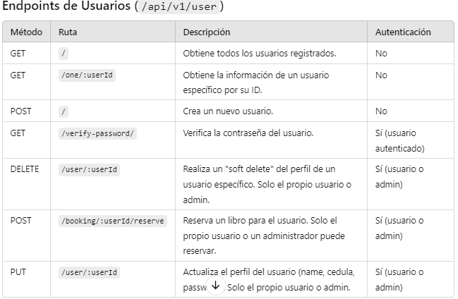
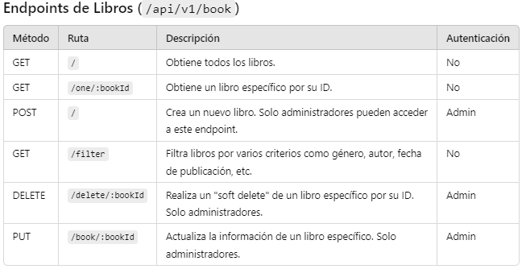
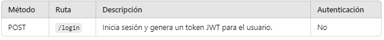

# Biblioteca Digital - Backend

Este proyecto es el backend para una plataforma de biblioteca digital que permite a los usuarios registrarse, iniciar sesión y reservar libros. Los administradores tienen permisos adicionales para agregar, actualizar y eliminar libros de la base de datos. Está construido en TypeScript y utiliza autenticación basada en tokens JWT para asegurar las operaciones restringidas.

## Tabla de Contenidos
- [Descripción del Proyecto](#descripción-del-proyecto)
- [Estructura del Proyecto](#estructura-del-proyecto)
- [Instalación](#instalación)
- [Scripts](#scripts)
- [Endpoints Principales](#endpoints-principales)
- [Consideraciones de Seguridad](#consideraciones-de-seguridad)

## Descripción del Proyecto
El proyecto implementa un backend para una biblioteca digital donde los usuarios pueden:
- Registrarse e iniciar sesión.
- Reservar libros disponibles.
- Administrar su perfil.
- Realizar consultas con múltiples filtros (género, autor, fecha de publicación, entre otros).

### Requerimientos
- Los usuarios solo pueden actualizar o eliminar su perfil.
- El registro y login de usuarios no requieren autenticación.
- Solo administradores pueden agregar, modificar o eliminar libros.
- La eliminación es un "soft delete", inhabilitando la entrada en lugar de borrarla permanentemente.

## Instalación
### 1. Clona el repositorio:
```bash
git clone https://github.com/Brancys/backend_project.git
cd backend_project
```
### 2. Instala las dependencias:
```bash
npm install
```
### 3. Configura las variables de entorno en el archivo nodemon.json
```bash
JWT_SECRET = your_jwt_secret
MONGO_CONN_STRING = your_database_uri
```

## Scripts
Ejecuta el servidor en modo de desarrollo
```bash
npm run dev
```
Compila el proyecto TypeScript a JavaScript.
```bash
npm run build
```
Ejecuta el servidor en producción usando el código compilado en la carpeta
```bash
npm start
```
## Endpoints 


###### Endpoint de Autenticación ( /api/v1/auth )


## Estructura del Proyecto

```plaintext
backend_project/
│
├── .gitignore
├── nodemon.json
├── package-lock.json
├── package.json
├── tsconfig.json
├── app.ts
├── db.ts
├── server.ts
│
├── src/
│   ├── middlewares/
│   │   ├── auth.routes.ts
│   │   └── auth.ts
│   │
│   ├── book/
│   │   └── v1/
│   │       ├── book.controller.ts
│   │       ├── book.model.ts
│   │       ├── book.routes.ts
│   │       ├── book.types.ts
│   │       ├── create.book.action.ts
│   │       ├── delete.book.action.ts
│   │       └── read.book.action.ts
│   │
│   └── user/
│       └── v1/
│           ├── create.user.action.ts
│           ├── delete.user.action.ts
│           ├── read.user.action.ts
│           ├── update.user.action.ts
│           ├── user.controller.ts
│           ├── user.model.ts
│           ├── user.routes.ts
│           └── user.types.ts